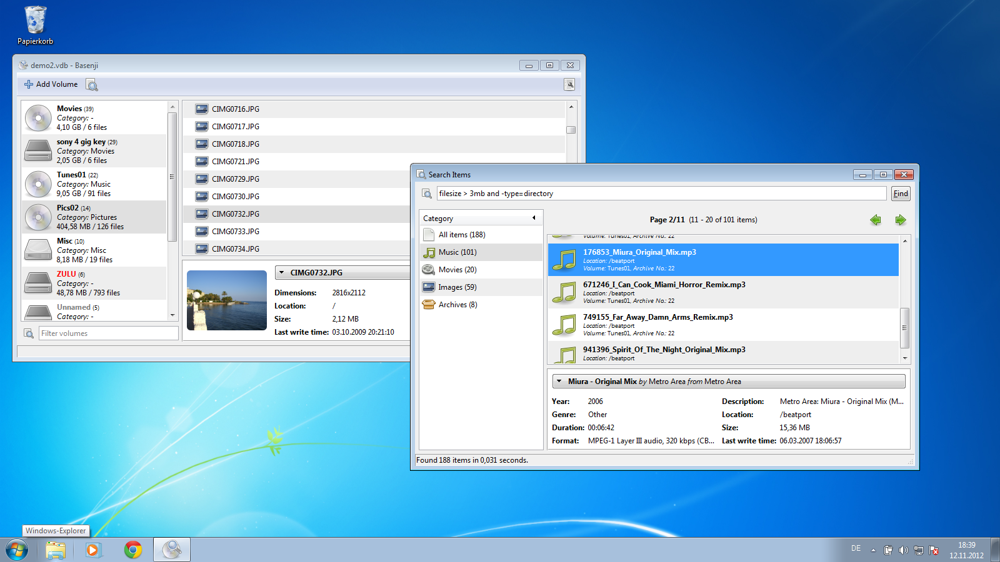

# Basenji
A cross-platform media indexing/search tool.  

Basenji is an indexing and search tool designed for easy and fast indexing of media collections.  
Once indexed, removable media such as CDs and USB sticks can be browsed and searched  
for specific files very quickly, without actually being connected to the computer.  
Besides file hierarchies and audio track listings, Basenji also presents extracted metadata  
(image dimensions, mp3 tags etc.) and content previews of indexed media in a clean and  
straightforward user interface.  
  
Basenji has been developed with platform independency in mind right from the start and  
presently consists of a GTK+ GUI frontend and a reusable library backend (VolumeDB) that  
implements the actual indexing, searching and storage logic.  
  
[Key features](http://pulb.github.io/basenji/features.htm)  
[Releases](https://www.github.com/pulb/basenji/releases)  
[Ubuntu packages](https://launchpad.net/~pulb/+archive/ppa)  
[Arch packages](https://aur.archlinux.org/packages/basenji)  
[Development](https://www.github.com/pulb/basenji)  
[Translations](https://translations.launchpad.net/basenji)

## Screenshots

[More screenshots...](http://pulb.github.io/basenji/screenshots/screenshots.htm)

## Building

### GNU/LINUX/GNOME:

###### Requirements

* mono (>= 2.4)
* libglib2.0-cil-dev (>= 2.12.9)
* libgtk2.0-cil-dev (>= 2.12.9)
* libgio-cil-dev (>= 2.22.2)
* libmono-cairo-cil (>= 2.4.2.3)
* libtaglib-cil-dev (>= 2.0.4.0)
* libgnome-desktop-3 (>= 3.8.4)
* libgdk-pixbuf2 (>= 2.30.7)

###### Compile

	./configure (non-gnome: ./configure --config=RELEASE)
	make
	make install

__NOTE:__  
if you get a "GLib.GException: Couldn't recognize the image file format for file 'data/basenji.svg'" runtime error,  
you most likely don't have SVG pixbuf loaders installed (package librsvg2-common in ubuntu).  
	

### MS Windows

###### Requirements

* .NET 4.0 Framework or higher
* Gtk# for .NET (http://www.go-mono.com/mono-downloads/download.html)
* System.Data.SQLite (http://system.data.sqlite.org/index.html/doc/trunk/www/downloads.wiki)
* taglib-sharp (https://github.com/mono/taglib-sharp)
* SharpZipLib (http://www.icsharpcode.net/OpenSource/SharpZipLib/Default.aspx)
	
###### Compile

Open Basenji_win32.sln in Visual Studio 2012.
